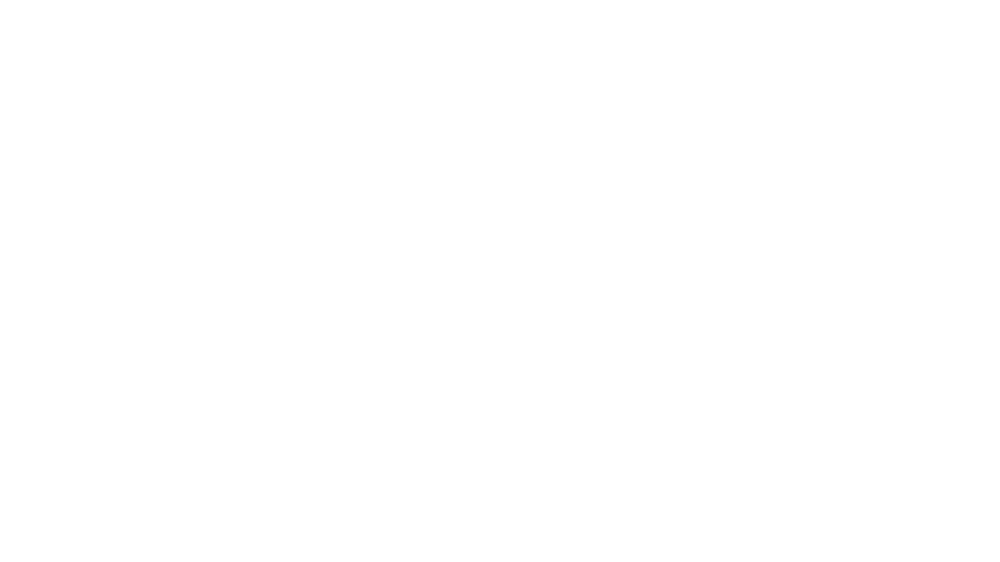

# Hi there, I'm Iva 👋

<div align="center">



<br/>

[](https://git.io/typing-svg)

</div>

---

## 🧠 About Me

I'm a **Machine Learning & AI systems developer** focused on building intelligent applications, speech processing pipelines and AI agents.

Currently working on **MoonCatAI** — a speech AI platform combining ASR, TTS and future AI agents.

```python
iva = {
    "role": "ML Engineer",
    "focus": ["Speech AI", "Neural Networks", "Data Analytics"],
    "current_project": "MoonCatAI",
    "stack": ["PyTorch", "Qt", "Python", "C++"],
    "interests": ["ASR", "TTS", "OCR", "LLM", "AI Agents"]
}
```

---

# 🚀 Featured Project

## 🐱 MoonCatAI

AI platform combining:

* 🎤 Speech Recognition (ASR)
* 🔊 Text-to-Speech (TTS)
* 📄 OCR (planned)
* ✂️ Text summarization (planned)
* 🤖 AI agents orchestration
* 🧩 Qt GUI interface
* 📊 Data storage system

---

# 🛠️ Tech Stack

## 🧠 Machine Learning & AI


---

## 🎤 Speech AI / NLP


---

## 💻 Languages


---

## 🖥️ GUI & Desktop


---

## 🗄️ Databases & Storage


---

## ⚙️ Tools & DevOps


# 🎯 Areas of Interest

```yaml
Machine Learning:
  - Speech recognition
  - Text-to-speech
  - Neural networks
  - Model training

AI Systems:
  - AI agents
  - ML pipelines
  - Real-time inference
  - AI orchestration

Data Analytics:
  - Data preprocessing
  - Feature engineering
  - Dataset pipelines
```

---

# 📈 Contribution Graph

[](https://github.com/kaidespada)

---

# 🤝 Connect With Me

<div align="center">

[](mailto:domerca.ru@gmail.com)
[](https://t.me/hehespada)

</div>

---

<div align="center">


</div>
